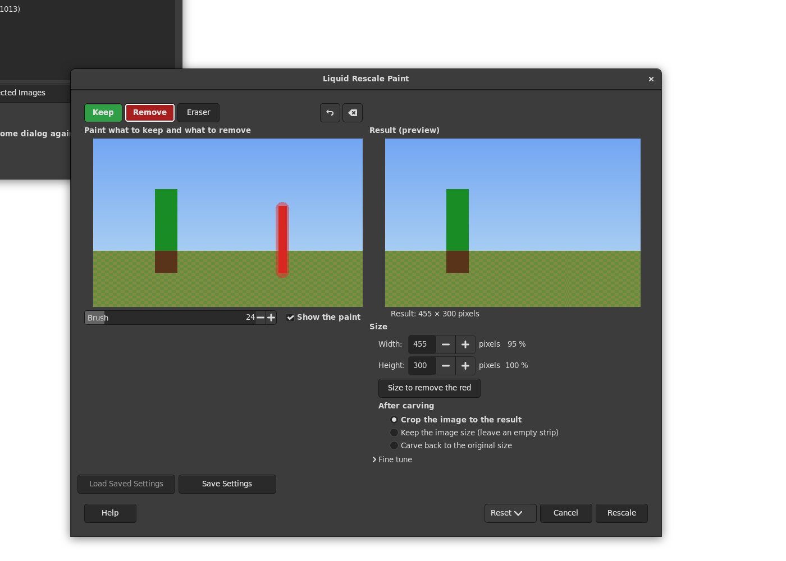

# Liquid Rescale TNG

A GIMP 3 plug-in for seam carving ("liquid rescale", content-aware
scaling) where you paint, right in its window, what to keep and what to
remove.

Layer > Liquid Rescale TNG... opens a window with the layer on the left
and the result, as it will be, on the right:

- **Keep** (green): paint what must keep its shape, such as people and
  faces. The seams go around it.
- **Remove** (red): paint what should go. The seams go through it first.
  **Size to remove the red** makes the layer just enough smaller for all
  of the red to go.
- **Straight** (blue): paint over lines that must stay straight, such as
  a horizon, a pole or the edge of a building: the seams bend less there
  (liblqr's rigidity mask). Straight can lie over Keep (a straight line in
  something kept; shown striped), but not over Remove: painting one takes
  the other away, as Keep and Remove do with each other, since what goes
  needs no straight lines and straight seams would follow it less well.
- **Eraser**, or the right mouse button, takes all paint away; **Undo**
  takes back a stroke.
- **Size**: the width and the height, linked in proportion to the layer by
  the chain button (off to start with), as in GIMP's Scale dialog.
- **After carving**: **Crop the image to the result** (the canvas fits the
  layer's new size, when the layer covered all of it), **Keep the image
  size** (an empty strip is left where the layer shrank, shown as a
  checkerboard in the result), **Carve back to the original size** (the
  red stays gone, and the layer and the canvas keep their size), or scale
  back with ordinary scaling, as the Liquid Rescale plug-in does: **Scale
  back to the original size**, **Scale back the width only** or **Scale
  back the height only** (the result keeps its proportions, so the other
  side changes; the canvas then fits the result when the layer covered
  it).
- **Output**: **Change the layer**, **A new layer above it** or **A new
  image**; the layer (or the image) stays as it was. With a new layer,
  "after carving" says the same about the canvas as for the layer itself
  (crop: the canvas fits the result, and the untouched layer reaches past
  it). A new image holds only the result, of the result's size, except
  with Keep the image size, where it has the layer's old size with the
  empty strip. The mask layers stay with the layer and keep fitting it;
  when they are carved along, carved copies go with the result (next to
  the new layer, or into the new image) and become its stored masks. A new
  image opens in its own window.
- The result on the right is carved again a moment after every change.
- **Fine tune**: rigidity (straighter seams everywhere), mask strength,
  the largest enlarging step, whether the mask layers are carved along,
  what counts as important (energy), which side goes first, and **Draw the
  seams**: the paths of pixels taken away (or added) on a new layer for
  each pass (the width, the height, and again when carving back), from the
  first colour to the last (yellow to dark red, as in the Liquid Rescale
  plug-in); in a gray image they are gray.

Under Straight, as in the Liquid Rescale plug-in, the rigidity is 3 times
the rigidity setting, and at least 3 times 20, so that painting works
with the setting at 0; elsewhere the setting applies as without a mask
(liblqr would give the pixels outside a rigidity mask no rigidity at
all).

The painted masks are stored as hidden layers next to the layer (Keep,
Remove and Straight (Liquid Rescale TNG)), and carved along with it, so
the next run starts from them (also Filters > Repeat, which uses the
masks stored for the layer). From scripts, any layer can be a mask
(keep-layer, remove-layer, rigidity-layer): its painted pixels (not
transparent, not black) count. The procedure returns the result layer and
its image.

Masks stored by this plug-in under its first name, Liquid Rescale Paint,
are still found, and take the new names when they are stored again.

Works on RGB and gray layers of every precision (8, 16, 32 bit, float),
with or without alpha, and carves a layer mask along.

## The original

Liquid Rescale TNG (The Next Generation) follows the
[Liquid Rescale](https://liquidrescale.wikidot.com/) plug-in by Carlo
Baldassi ([gimp-lqr-plugin](https://github.com/carlobaldassi/gimp-lqr-plugin),
GIMP 2), whose library [liblqr](https://github.com/carlobaldassi/liblqr)
does the seam carving; the plug-in builds it in. This is a new plug-in, not
a port: the faithful GIMP 3 port of Liquid Rescale, with its own workflow
of mask layers painted on the canvas, lives at
[github.com/sandbranch/gimp-lqr](https://github.com/sandbranch/gimp-lqr).

## Building and installing

Needs meson, ninja, a C compiler and the GIMP 3 development files; liblqr
is used from the system or built in (`-Dbundled_liblqr=enabled` to always
build it in).

    meson setup build -Dplugindir=$HOME/.config/GIMP/3.2/plug-ins
    ninja -C build install

For the Flatpak version of GIMP, build inside it with
[gimp-devtools](https://github.com/sandbranch/gimp-devtools):

    gimp-build.sh . meson setup build -Dplugindir=\$GIMP_PLUGINDIR
    gimp-build.sh . ninja -C build install

Restart GIMP after installing.

## Tests

    tests/run.sh           unit tests, then the plug-in in a GIMP without a window
    tests/run.sh --asan    the same with AddressSanitizer and UBSan

The unit tests (`tests/unit`) check the seam carving and the masks without
GIMP; `tests/gimp-test.py` runs the plug-in on generated images of every
precision and type and checks the results pixel by pixel, in a throwaway
GIMP profile.

    tests/gui/gui-test.sh        the dialog as a user would use it
    tests/gui/start.sh [photo]   the dialog to try by hand
    tests/gui/look.sh <name> [step...]   a screenshot after some steps

`gui-test.sh` opens the dialog on a Broadway display (GTK in a web page)
and drives it from a headless Chrome with
[gimp-devtools](https://github.com/sandbranch/gimp-devtools)'
`gui/cdp.mjs`: it paints a red post with Remove and a line of the sky with
Straight, presses Size to remove the red and Rescale, and checks that the
post is gone, the tree whole, and the mask layers stored. Screenshots of each step are left in `tests/output/gui/`.
`look.sh` opens the dialog the same way, does the steps given (clicks at
positions in the dialog, keys, text) and leaves a screenshot there, for
looking at the layout; `LQRT_SCENE=300x500` makes the generated scene
another size, such as a portrait one. Only the GIMP these scripts start
is stopped at the end, not other runs of the Flatpak.

## License

GPL version 3 or later, see COPYING. liblqr is LGPL version 3 or later.
